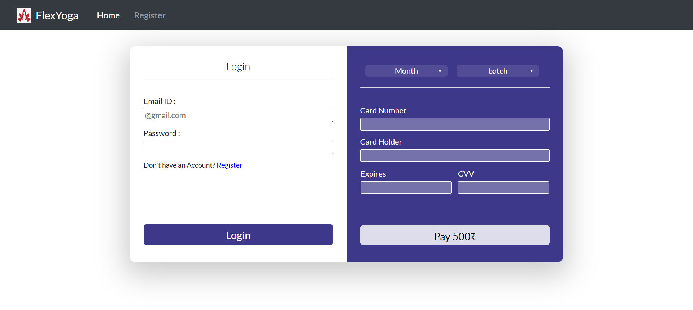
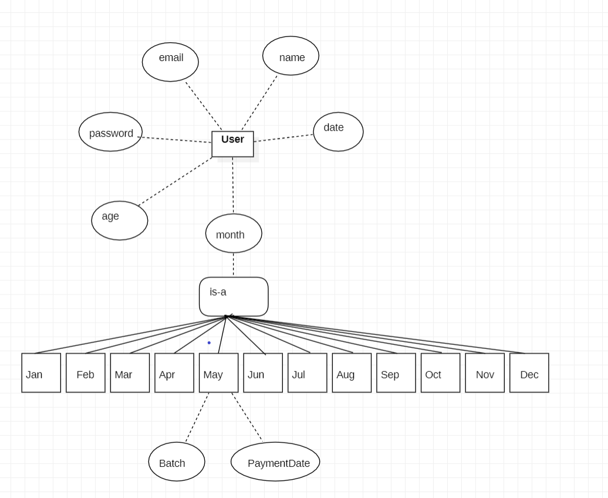

# OnlineLogsReader
Read online logs from file which is present at server. 
 
 

# Project Setup

### `npm install`

To install all project's dependencies.\
Run in client as well as in root folder.

### `npm run dev`

To run application in local Server.\
Open [http://localhost:3000](http://localhost:3000) to view it in your browser.

### `npm run client`

To run client application individually.\
Open [http://localhost:3000](http://localhost:3000) to view it in your browser.

### `npm run server`

To run server application individually.\
Open [http://localhost:80](http://localhost:80) to view it in your browser.  
